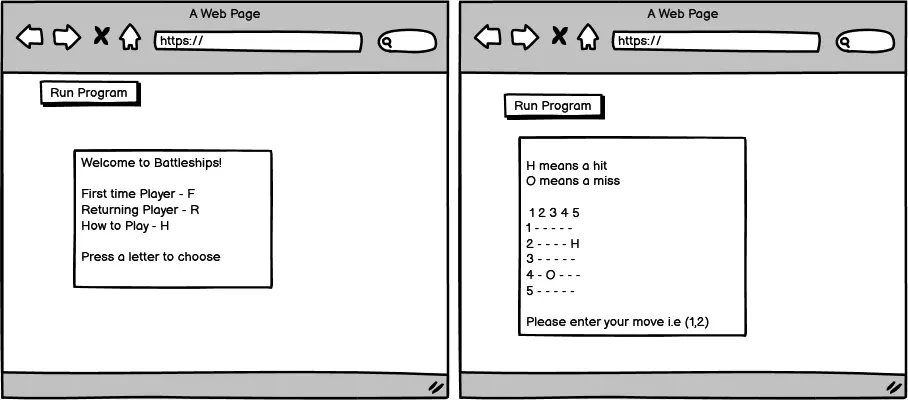
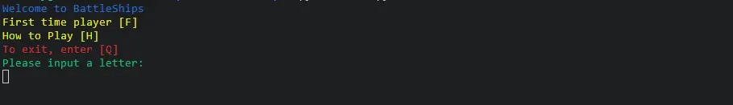
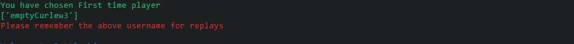
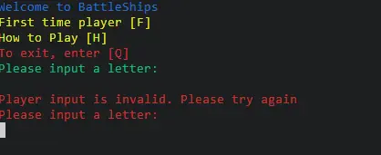
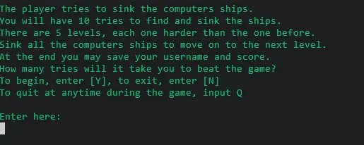
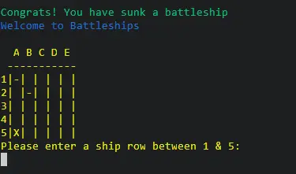
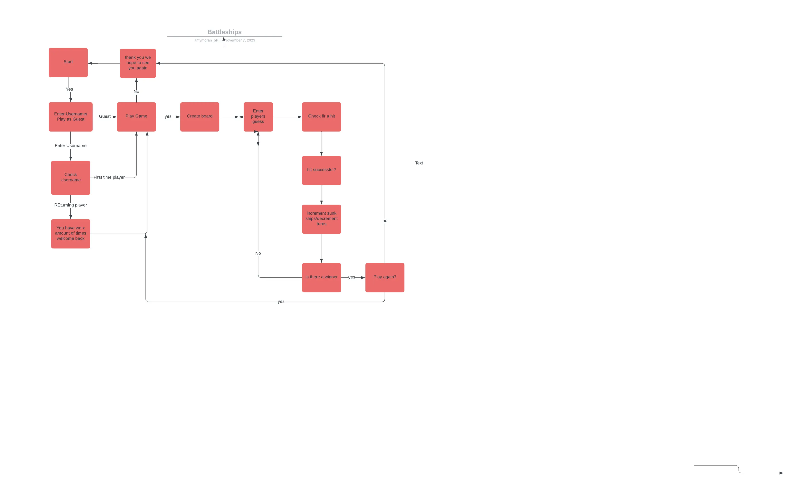
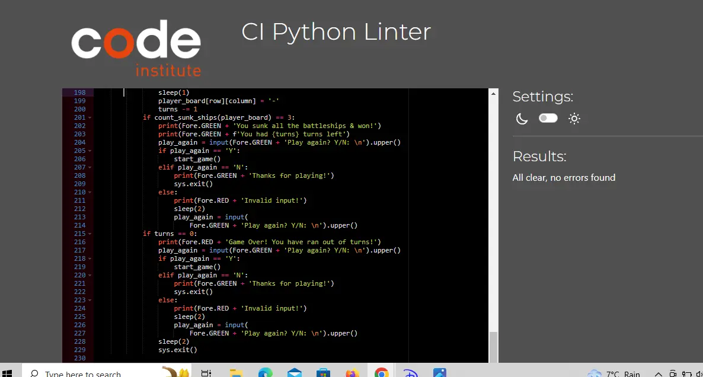

# Battleships!
This is a Python terminal based game where the player has to try and locate the computers ships and sink them before the computer finds theirs. 

## User Experience

### User Stories

- First time visitor Goals

  - As a first time visitor I want to learn how to play the game.
  - As a first time visitor I want to navigate easily through the game.
  - As a first time visitor I want the option to record my score.
  - As a first time visitor I want to be able to see my score.
  - As a first time visitor I want the option to begin playing without having to enter a username.
  - As a first time visitor I want the option to replay the game once finished.

- Returning Visitor Goals

  - As a returning visitor I want to be able to progress to a higher difficulty.
  - As a returning visitor I want to be able to see my progress/score and compare previous playthroughs.
  - As a returning visitor I want to be able to bypass instructional sections.

### Wireframes

## Features 

### Welcome Screen
The user is welcomed to the game of battleships. The user is given a list of options to choose from. They can begin to play as a first time player, they can choose to read the instructions of the game. Or if they change their mind about playing, they can quit the program.

### First time player 
A random username is generated for the player and saved to a googlesheet. This prevents duplicate usernames from being used accidentally by the user. This username will be used to record user score to a scoreboard in a future feature.

### Input validation
Input validation is undertaken everytime a user makes an input. If input is invalid, the user will be told so, and prompted to enter a valid input.

### How to Play
The 'How to Play' screen prints the basic instructions for battleships gameplay to the screen. User then has the option to continue or to quit the program.

### Game Board
The game is played on a 5 by 5 grid.
The computer generates 3 ships at random and places them on the board
Player enters co-ordinates. Hits are marked with an X, Misses are marked with a -.
Messages are printed to tell the player if they have hit, missed or already guessed a co-ordinate.

### Game Play
The player gets to choose between 3 difficulty levels. 
The number of turns/guesses the player gets decreases the higher the level chosen

### Ending the game
The game ends when a player has sunk all three ships or runs out of turns.
The player is then given the option of playing again or quitting. The game is designed to keep looping until the player decides to quit.

### Exiting the game
The player has the option to quit the game at anytime by inputting the letter Q

### Future Features
I would like to add a save score feature in the future which will save score to the google spreadsheeets and allow the user to access their scores upon returning to the game and inputting the username they were given at random as a first time player. Unfortunately I ran out of time to implement in this project.

## Flowcharts 

A flowchart was drawn up to help plan the games functionality

## Testing
The game has been manually tested at all stages of development.
 - The code has been validated using the CI Python Linter and passed with no issues.
 - Inputs have been tested for invalid data entries and empty strings.

 

## Technology

### Language used

- Python

### Frameworks & Tools

- Heroku
- Git
- GitHub
- Lucid Chart
- Prettier Code Formatter
- Balsamiq

### Libraries used

- The random library was used to produce random numbers for placing the ships on the board.
- The generate username library was used to produce random usernames for players.
- The time library was used to delay the speed of the printed messages so the player has more time to read them.
- The gspread was used to add usernames to the spreadsheet for a future feature.
- The google.oauth2.service_account import Credentials was used to connect to the google spreadsheets
- Colorama was used to add color to the terminal
-Sys was added to allow use of the exit method to quit the program.

## Bugs

- During testing, I found that the game board was not resetting when a player chose to play again.
I solved this by moving the player board variable into the play again while loop.

- There is an unresolved bug whereby the last co-ordinate fired upon before the game ends does not print to the gameboard.

- There is an issue with the input error handling in the welcome function and how to play function. After inputting a correct choice following a wrong input the game exits.

## Deployment

## Credits

- The game was inspired by https://www.youtube.com/watch?v=tF1WRCrd_HQ
- I would like to thank my mentor Narender for all his help during this project.
- I would like to thank Tutor Support for their guidance throughout the project.